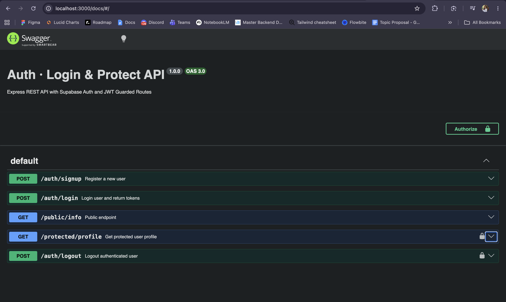

# Auth · Login & Protect

A secure Node.js & Express REST API using **Supabase Auth** for account management, JWT authentication, and protected routes guarded by middleware.

---

### Stage 0: Setup & Infrastructure
- [x] Initialized Node.js environment with Express framework.
- [x] Configured `.env` secrets (`SUPABASE_URL`, `SUPABASE_KEY`) and added `.gitignore`.
- [x] Connected to Supabase Auth client using `@supabase/supabase-js`.

### Stage 1: Open Auth — Sign Up & Log In
- [x] **`POST /auth/signup`**: Registers users via Supabase (`201 Created` on success, `400` on missing fields).
- [x] **`POST /auth/login`**: Authenticates users and returns JWT access & refresh tokens (`200 OK` on success, `401` on invalid credentials).

### Stage 2 & 3: Public Gates & Token Verification
- [x] **`GET /public/info`**: Public endpoint returning `200 OK` without authentication.
- [x] **`GET /protected/profile`**: Token verification using `supabase.auth.getUser(token)`. Returns `401 Unauthorized` if token is missing, expired, or tampered with.

### Stage 4: Middleware Protection & Logout (Completed)
- [x] **`POST /auth/logout`**: Ends user session via `supabase.auth.signOut()` (`204 No Content` on success).

### Stage 5: OpenAPI & Swagger Documentation
- [x] **Swagger UI Integration**: Served interactive documentation at `/docs` using `swagger-ui-express`.
- [x] **Bearer Auth Scheme**: Configured `bearerAuth` security in OpenAPI specification to enable browser testing with JWT padlocks.

### Stage 6: Publish & Documentation
- [x] **Environment Protection**: Git-ignored secrets and provided `.env.example`.
- [x] **GitHub Repository**: Published clean git history with structured commit checkpoints.

---

## API Reference Table

| Route | Method | Auth Required | Description | Status Codes |
| :--- | :---: | :---: | :--- | :--- |
| `/public/info` | `GET` |  None | Returns public information accessible to anyone. | `200` |
| `/auth/signup` | `POST` |  None | Registers a new user account with `email` and `password`. | `201`, `400` |
| `/auth/login` | `POST` | None | Authenticates user credentials and returns JWT `access_token` and `refresh_token`. | `200`, `401` |
| `/protected/profile` | `GET` | Bearer JWT | Retrieves user details (ID, email, creation date) for authenticated users. | `200`, `401` |
| `/protected/dashboard` | `GET` | Bearer JWT | Demonstration route proving auth middleware reusability. | `200`, `401` |
| `/auth/logout` | `POST` |  Bearer JWT | Revokes the current session via Supabase Auth. | `204`, `401` |

---

## Swagger UI Preview



---

## Environment & Setup
1. Prerequisites
* **Node.js**: v18+ recommended
* **Supabase Account**: Free project created at [supabase.com](https://supabase.com)

2. Installation
```bash
git clone <your-repo-url>
cd Auth-Login-and-Protect
npm install
3. Environment Setup
Copy the example environment file and populate it with your Supabase credentials:

Bash
cp .env.example .env

4. Run Server
Bash
node app.js

Interactive API Testing
Via Swagger UI (Browser)
Start your application server (node app.js).

Open http://localhost:3000/docs in your browser.
Click Authorize, paste an access_token from /auth/login, and confirm.
Execute test calls directly against protected endpoints using the Try it out button.
Bash: 
# 1. Sign Up
curl -i -X POST http://localhost:3000/auth/signup \
  -H "Content-Type: application/json" \
  -d '{"email":"test@example.com","password":"password123"}'

# 2. Log In
curl -i -X POST http://localhost:3000/auth/login \
  -H "Content-Type: application/json" \
  -d '{"email":"test@example.com","password":"password123"}'

# 3. Access Protected Route
curl -i http://localhost:3000/protected/profile \
  -H "Authorization: Bearer <YOUR_ACCESS_TOKEN>"

# 4. Log Out
curl -i -X POST http://localhost:3000/auth/logout \
  -H "Authorization: Bearer <YOUR_ACCESS_TOKEN>"

